# Grape Segmentation

The purpose of this code is to segment the grapes in the field usign deep neural networks. This architecture was inspired by [U-Net: Convolutional Networks for Biomedical Image Segmentation](http://lmb.informatik.uni-freiburg.de/people/ronneber/u-net/).

### Data

We used 2 datasets to train U-Net for grape segmentation. 
- The KALALA Dataset  : Purple Grapes - not annotated originally - Annotated using Matlab Graph Cut.
- Embrapa Wine Grape Instance Segmentation Dataset (Embrapa [WGISD](https://github.com/thsant/wgisd) based on this [paper](https://arxiv.org/abs/1907.11819)) : Green Grapes - with labels 

### Data augmentation

We use ImageDataGenerator in keras.preprocessing.image for augmenting the data by implementing image rotation, shift, rescale, shear, zoom,...
The augmentaion documentation could be found [here](https://keras.io/preprocessing/image/)

See dataPrepare.ipynb and data.py for detail.

### Model

This deep neural network is implemented with Keras functional API, which makes it extremely easy to experiment with different interesting architectures.

Output from the network is a 256*256 which represents mask that should be learned. Sigmoid activation function
makes sure that mask pixels are in \[0, 1\] range.

### Training

The network was trained with 602 256*256 images. The training data could be found [here](https://drive.google.com/drive/folders/1r3HPxAcmtHXD9vOMfSvwOsLLZmLlMhU3?usp=sharing)
Also you can download the pre-trained model (trained with the above data) from [here](https://drive.google.com/file/d/1dnvFk5oFDl2IKnEynlcQuBGEJiobj2RJ/view?usp=sharing)

After 5 epochs, calculated accuracy is about 0.83.

Loss function for the training is basically just a binary crossentropy.

---

## How to use

### Dependencies

This network depends on the following libraries:

* Tensorflow
* Keras >= 1.0

Also, this code should be compatible with Python versions 2.7-3.5.

# Run the Model

To train and test the model, run the corresponding cells in trainUnet.ipynb

### Results

The segmentation result on test data gained 80% IOU.

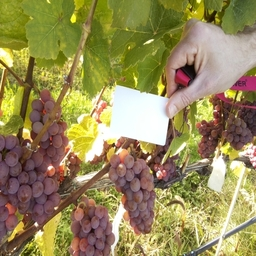
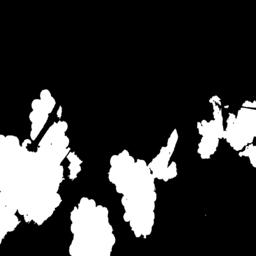
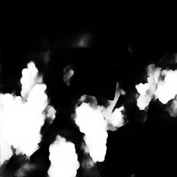
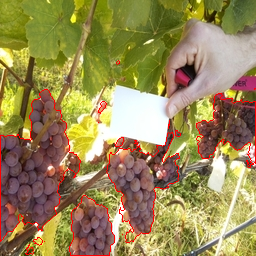

_______________________________________________________________________

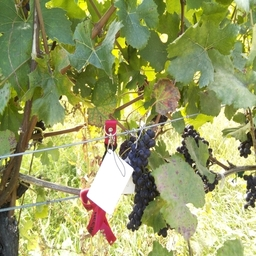
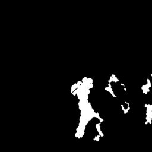
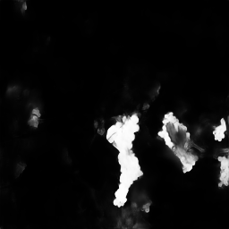
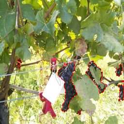

_______________________________________________________________________

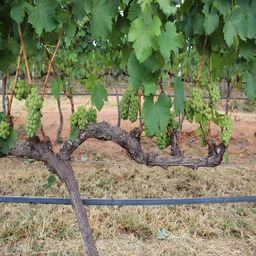
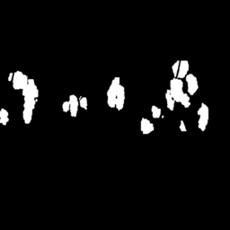
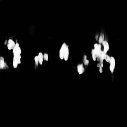
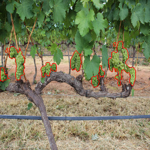
